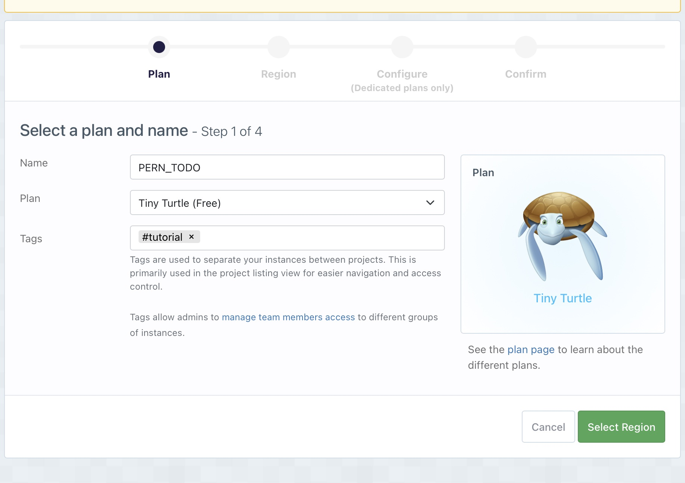
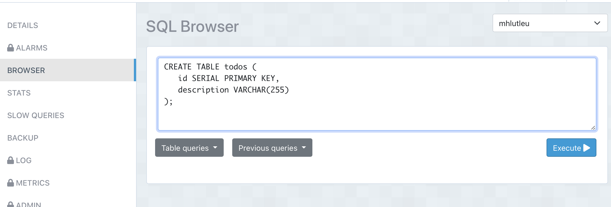
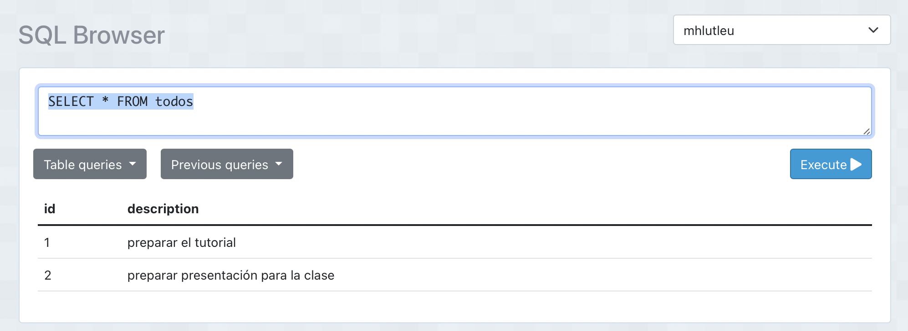
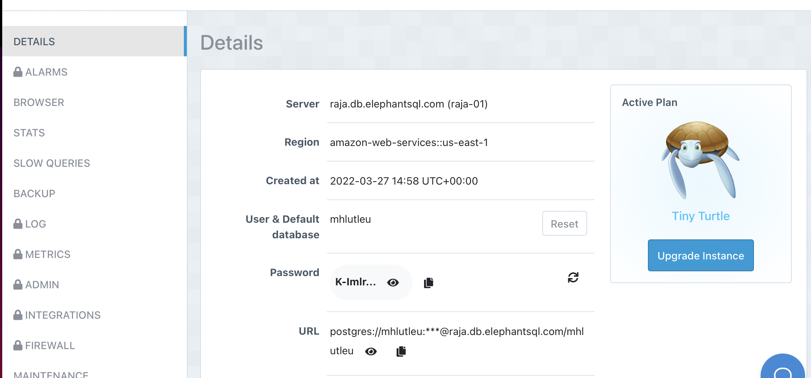

## Preparación

### En replit:

Crear un replit con node.js

```
   $ npm i express pg cors
```

### En tu PC:

Instala node.js, puedes descargarlo desde acá: https://nodejs.org/en/download/

Crear una carpeta e inicializar node dentro de esta:

  ```
  $ mkdir tutorial-server
  $ cd tutorial-server
  $ npm init
  $ npm i express pg cors
  ```
  
El comando npm init te preguntará diversa información de tu proyecto, puedes llenarla o dejarla en blanco simplemente presionando `enter`, no es relevante para este ejercicio.

## Inicializando un servidor node

Modifica el archivo index.js agrega este código:

  
```javascript
// index.js
const express = require("express")
const app = express()
const cors = require("cors")

const PORT = process.env.SERVER_PORT

//middleware
app.use(cors())
app.use(express.json())


app.listen(PORT, () => {
	console.log("servidor iniciado en puerto " + PORT)
})
```

## Ejecuta el servidor

Ejecuta el servidor como se explica más abajo. En la consola debe aparecer el mensaje:

    servidor iniciado en puerto 3001


### En Replit:

Configura un secret llamado SERVER_PORT e inicializalo con el valor 3001.

Los secrets están en el lado izquierdo y aparacen al presionar el botón con el candado.

Luego presiona el botón `> RUN` que aparece en la parte superior de replit.

En el lado derecho aparecerá un mini navegador web apuntando a tu servidor y aparecerá el mensaje:

    Cannot GET /
    

### En tu PC:

Si no existe el archivo index.js puedes crearlo con tu editor.

Para ejecutar tu programa debes hacer:

MacOs o Linux:

  $ SERVER_PORT=3001 node index

Windows usando cmd:

  > set SERVER_PORT=3001 && node index

Windows usando PowerShell

  PS> $env:SERVER_PORT=3001 ; node index

Navega a la dirección http://localhost:3001/ y debería aparecer una página con este mensaje:

    Cannot GET /

## Crear la base de datos

Vamos a crear una base de datos.

En este caso vamos a usar una conexion usando el servicio ElephantSQL, en la dirección: https://www.elephantsql.com

Este servicio nos provee acceso a instancias de PostgresSQL en la nube.

Una vez registrados presionamos el botón `new instance` que aparece en la parte superior de la página:


Elegimos crear una instancia tipo "Tiny Turtle" y llenamos el formulario con estos datos:



Después eliges la región, sugiero aceptar los parámetros ofrecidos, y finalmente confirmas.

Después eliges de la lista de instancias (si es que has creado otras bases de datos) la instancia PERN_TODO y en el menú de la izquierda eliges la opción BROWSE. DE este modo abres el browser y en la caja de texto escribes esta sentencia SQL

```SQL
CREATE TABLE todos (
   id SERIAL PRIMARY KEY,
   description VARCHAR(255)
);
```

Tal como se muestra en esta imagen (recuerda presionar el botón `execute >`):




### En tu PC

Si tienes PostgreSQL instalado en tu PC puedes crear la base datos con este comando:

```SQL
CREATE DATABASE pern_todo;
```

Y creas la tabla usando la sentencia descrita anteriormente.
Hay varias formas de hacer esto, por ejemplo se puede usando el comando `psql`.

En tu PC también puedes usar la base de datos que crearemos en ElephantSQL, así que no incluiré más instrucciones sobre PostgresSQL para PC, pero es relativamente fácil hacer lo mismo que hacemos con ElephantSQL en tu PC.

### Creando unos registros en la base de datos.

En el SQL Browser ejecuta estos comandos:

```SQL
INSERT INTO todos(description) VALUES('preparar el tutorial');
INSERT INTO todos(description) VALUES('preparar presentación para la clase');
```

(Recuerda presionar el botón `Execute >`).

Luego puedes verificar que has creado los registros con este comando:

```SQL
SELECT * FROM todos
```

Deberias poder ver los dos registros en el browser



## Conectando la base de datos

Selecciona `DETAILS` en ElephantSQL y accederás a una página con los detalles de conexión a la BD. Copia el valor que aparece en url al clipboard y úsalo para crear un secret llamado `CONNECTION_URL`.



Fíjate que el campo URL tiene un botón que permite copiar este valor al clipboard.

Luego crea el archivo `db.js` y escribe este código en este:

```javascript
// db.js

const Pool = require("pg").Pool

const connUrl = process.env.CONNECTION_URL

const pool = new Pool({
    connUrl,
})

module.exports = pool
```

Y agrega esta linea en `index.js`, justo debajo de la declaraciónd de `cors`:

```javascript
const pool = require("./db")
```

Ejecuta `run >` nuevamente.

## Recuperar los registros (GET)

Agrega este código en index.js antes de `app.listen()...`:

```javascript
//get all todos
app.get("/todos", async (req, res) => {
    try {
        const allTodos = await pool.query(
            "SELECT * FROM todos"
        )
        res.json(allTodos.rows)
    } catch (err) {
        console.error(err.message)
    }
})

```

Re inicia el server y verás esta resultado:

```
[
  {"id":1,"description":"preparar el tutorial"},
  {"id":2,"description":"preparar presentación para la clase"}
]
```

Que es la representación en formato JSON de los registros que están en nuestra base de datos.

**¡Felicitaciones, has creado tu primer endpoint RESTFul!**


## Crear un registro (POST)

Ahora agregaremos un métdodo POST asociado al endpoint `/todos` para poder crear registros.

Agrega este código antes de

```javascript
//create a todo
app.post("/todos", async (req, res) => {
    try {
        const { description } = req.body
        const newTodo = await pool.query(
            "INSERT INTO todos(description) VALUES($1) RETURNING *",
            [description]
        )
        res.json(newTodo.rows[0])
    } catch (err) {
        console.error(err.message)
    }
})
```

### Probando el endpoint usando curl

En el Shell de Replit ejecuta curl de la siguiente forma:

  curl -X POST -H "Content-Type: application/json" \
    -d '{"description": "publicar servicio "}' \
    https://url-replit/todos

Puedes recuperar (GET) usando curl de esta forma:

  https://url-replit/todos

Reemplaza `url-replit` por el valor que genera REPLIT para tu entorno.

Para probar esto en tu PC reemplaza `url-replit` por `localhost:3001`
